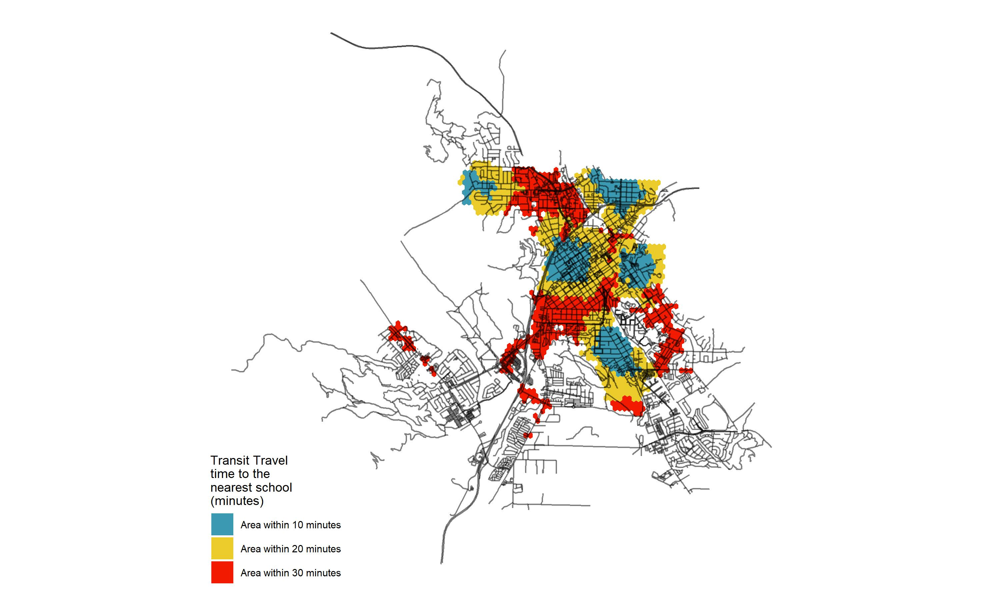

```{r setup, include=FALSE}
knitr::opts_chunk$set(echo = TRUE)
```

# Introduction

This portfolio demonstrates the skill learner in VIS 2128 Spatial Analysis with Carole Voulgaris. The webpage was created directly in RStudio.

My portfolio demonstrates each of the following skills:

* Displaying multiple vector layers on the same map
* Calculating and displaying relationships among point and polygon layers based on distance
* Aggregating point data to a layer of polygons
* Calculating and displaying accessibility, based on travel time
* Converting between raster layers and vector layers
* Displaying raster data on a map
* Georeferencing a raster image
* Displaying data on an interactive map

# Maps of Boston
Here are two maps of Boston.

## Interactive Map
This interactive map demonstrates the following skills: 

* Displaying data on an interactive map

[](https://samanthanlewis.github.io/spatial_portfolio//fullsize/black_fem_pop.html){target="_blank"}

[](https://samanthanlewis.github.io/spatial_portfolio//fullsize/black_no_insurance.html){target="_blank"}

## Clockboard Map
This map demonstrates the following skills:

* Aggregating point data to a layer of polygons

[](https://samanthanlewis.github.io/spatial_portfolio/s/fullsize/clockboard.pdf){target="_blank"}

# Maps of San Luis Obispo
Here are two maps of San Luis Obispo, California. I might include some text here as well.

## Isochrones
This map shows isochrones based on transit travel times to the nearest school. It demonstrates the following skills:

* Displaying multiple vector layers on the same map
* Calculating and displaying accessibility, based on travel time

[](https://samanthanlewis.github.io/spatial_portfolio//fullsize/SLO_schools.pdf){target="_blank"}

## Accessibility
This map shows accessibility based on a distance-decay function of the walking time to the nearest transit stop. It demonstrates the following skills:

* Displaying multiple vector layers on the same map
* Calculating and displaying accessibility, based on travel time
* Displaying raster data on a map

[](https://samanthanlewis.github.io/spatial_portfolio//fullsize/SLO_transit.pdf){target="_blank"}
